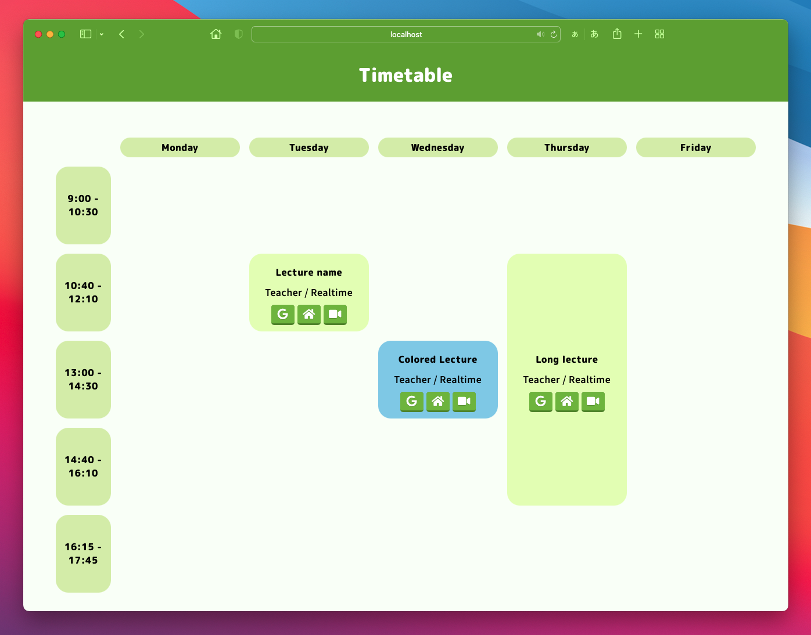

# timetable-page

Timetable page generator




## Installation

### Method A: Cloning this repository

Execute

```sh
git clone https://github.com/TrpFrog/timetable-page.git
```

**or** download the zip file from [this page](https://github.com/TrpFrog/timetable-page/archive/refs/heads/main.zip) and unarchive it.

Then, read the section **Getting Started**

### Method B: Using Docker

Execute these commands.

```sh
# Pull the docker image
docker pull ghcr.io/trpfrog/timetable:latest

# Create a project folder
mkdir timetable
cd timetable
touch timetable.js

# Run
docker run -d -p 80:80 \
    -v $PWD/timetable.js:/usr/share/nginx/html/timetable.js \
    --name timetable \
    ghcr.io/trpfrog/timetable

# Copy the timetable template
docker cp timetable:/usr/share/nginx/html/timetable-example.js ./timetable.js                            
```

Then, access `localhost`, you can see your timetable.


## Getting Started

Enter your timetable information into timetable.js, the information will be automatically reflected in index.html!

### First step

**IMPORTANT**: Firstly, rename `timetable-example.js` to `timetable.js`. It will not work without this operation.

### timetable.js

```javascript
const page_title = 'Timetable';
const time = ['9:00 - 10:30', '10:40 - 12:10', '13:00 - 14:30', '14:40 - 16:10', '16:15 - 17:45'];
const day_of_weeks = ['Monday', 'Tuesday', 'Wednesday', 'Thursday', 'Friday'];
const color_theme = '../color-themes/green-theme.css';
```
- **page_title**: Page title displayed on the header
- **time**: Time when the n-th period lecture will be held
- **day_of_week**: Name of the day of the week to be displayed
- **color_theme**: Path to the color theme (v2.1 - )
    - You can use prepared theme in the *color-themes* folder.
    - Also you can make your own color theme and use it.

```javascript
const timetable = [
    {
        "name": "Lecture name",
        "teacher": "Teacher Name",
        "day_of_week": "mon", // You can use [mon, tue, wed, thu, fri]
        "time": 2,
        "lect_length": 1,
        "type": "Realtime",
        "google_classroom": "https://trpfrog.net",
        "webclass": "https://trpfrog.net",
        "link": "https://trpfrog.net",
        "link2": "https://trpfrog.net",
        "zoom": "https://trpfrog.net",
        "zoom_id": "0123456789",
        "zoom_password": "9876543210",
        "id": "userid",
        "password": "password",
        "color": "#90e200",
    },
    // the same continues below...
]
```
- **name**: Name of lecture

- **teacher**: Name of teacher

- **day_of_week**: Day of week this lecture held
    - You *must* use `mon`, `tue`, `wed`, `thu`, or `fri`
    - *REQUIRED PROPERTY*
    
- **time**: n-th period of this lecture
    - *REQUIRED PROPERTY*
    
- **lect_length**: The length of the lecture
    - *REQUIRED PROPERTY*
    
- **type**: Form of lecture
    - Example: realtime, on-demand, face-to-face
    
- **google_classroom**: Google classroom URL

- **webclass**: Webclass URL

- **link**: Homepage URL

- **link2**: Another homepage URL

- **zoom**: Video meetings URL

- **zoom_id**: ID of a video meeting room.
    - It is convenient if there are no meeting room URLs.
    
- **zoom_password**: Password of a video meeting room.

-   **id**: Some kind of an user ID

-   **password**: Some kind of a password

- **color**: Background color of this lecture
    
    - You can use CSS style color including color code (#90e200) and rgba function.
    - If left blank, used default color
    
    

Now that timetable.js is complete, let's open index.html. **You can see the timetable generated.** It is convenient to set this as your browser's home page.

### docker-compose.yml (Optional)

**ADDED: 2021-09-30**

Using docker-compose, you can host web server easier.
In addition, changes you made in src folder will be reflected immediately. (Of course, `docker run -v ...` can do same but this is easier.)

```sh
# Start
$ docker-compose up
# Stop
$ docker-compose stop
```


## Caution

If you put **important information** (such as video meeting URL) in timetable.js, you **MUST NEVER** publish that information on the Internet!

I will not be held responsible for any damage caused by the disclosure of links or other information.


## License

This software is released under the MIT License.

These fonts used in this repository are licensed under [Open Font License](https://scripts.sil.org/OFL).

- [Noto Sans Japanese](https://fonts.google.com/noto/specimen/Noto+Sans+JP/about) by Google
- [M PLUS Rounded 1c](https://fonts.google.com/specimen/M+PLUS+Rounded+1c?subset=japanese) by Coji Morishita, M+ Fonts Project
- [Font Awesome Free](https://fontawesome.com/) by Font Awesome
